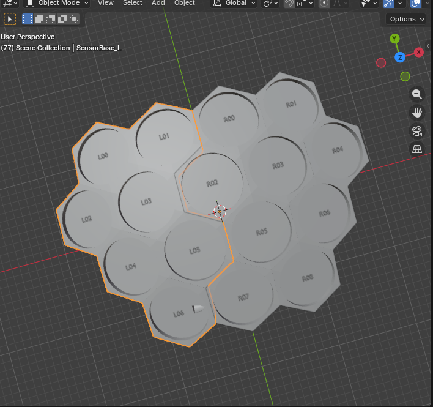

# Jaiva Hexa Drum



A parametric hexagonal drum pad designed in Blender, intended for physical fabrication (3D printing). The pad consists of a dome-shaped array of hexagonal tiles, each with a recessed cup to hold a circular sensor (e.g. piezo disc), and alignment pin holes at the tile boundaries for assembly.

## Overview

The pad is split into two halves — **Left** and **Right** — that join along a vertical center line. This makes it printable on standard-sized 3D printers. Alignment dowel pins lock the halves together at four pair points.

The tile surface follows a cosine dome profile, so the playing surface is gently curved rather than flat.

## Files

| File | Description |
|---|---|
| `jaiva-hexa-drum-script.py` | Blender Python script that generates the full geometry |
| `jaiva-drum-hexa-cut-e-dowels.blend` | Blender project file |

## How It Works

The script (`jaiva-hexa-drum-script.py`) is run inside Blender's scripting workspace. It:

1. Lays out a 16-tile hexagonal grid (4 rows, flat-top orientation)
2. Finds the best vertical split to divide the grid into Left (L) and Right (R) halves
3. For each tile:
   - Builds a hexagonal prism
   - Displaces the top vertices along a cosine dome surface
   - Cuts a cylindrical cup recess for the sensor
   - Cuts a pin hole through the appropriate side face (for assigned tiles)
4. Joins each half into a single mesh (`SensorBase_L`, `SensorBase_R`)
5. Exports both halves as `.stl` and `.obj` files alongside the `.blend` file

## Key Parameters

| Parameter | Value | Description |
|---|---|---|
| `SENSOR_DIA` | 69 mm | Diameter of the sensor cup recess |
| `PLATE_H` | 6 mm | Thickness of each hex tile |
| `HEX_FLAT_WIDTH` | 77 mm | Flat-to-flat width of each hexagon |
| `DOME_HEIGHT` | 40 mm | Maximum height of the dome at center |
| `DOME_RADIUS` | 210 mm | Radius of the dome profile |
| `PIN_DIAMETER` | 15 mm | Dowel pin diameter |
| `PIN_DEPTH` | 20 mm | Depth of pin holes |
| `PIN_Z` | 20 mm | Vertical position of pin hole centers |

## Tile Grid Layout

The grid contains 16 hexagonal tiles arranged in 4 rows:

```
Row 3 (top):    L L L L         (4 tiles)
Row 2:        L L L R R R R R   (tiles span split)
Row 1:          L L R R R R     (tiles span split)
Row 0 (bot):      L L R R R     (tiles span split)
```

The exact split is computed automatically to find the largest gap between tile columns.

## Pin Hole Pairs

Four pairs of alignment pin holes are drilled across the split seam:

| Pair | Left tile | Right tile |
|---|---|---|
| Pair 1 | L01 (right face) | R00 (left face) |
| Pair 2 | L03 (right face) | R02 (left face) |
| Pair 3 | L05 (right face) | R05 (left face) |
| Pair 4 | L06 (right face) | R07 (left face) |

Holes are cut **per-tile before joining** to guarantee the boolean cutter always intersects solid material.

## Running the Script

1. Open `jaiva-drum-hexa-cut-e-dowels.blend` in Blender (3.x or later recommended)
2. Go to the **Scripting** workspace
3. Open `jaiva-hexa-drum-script.py`
4. Click **Run Script**

The script clears any previous geometry, rebuilds all tiles, joins each half, and exports the STL/OBJ files to the same directory as the `.blend` file.

## Output

- `hex_dome_v52_L.stl` — left half, ready to print
- `hex_dome_v52_R.stl` — right half, ready to print
- (`.obj` fallback if STL export is unavailable in the Blender version)
